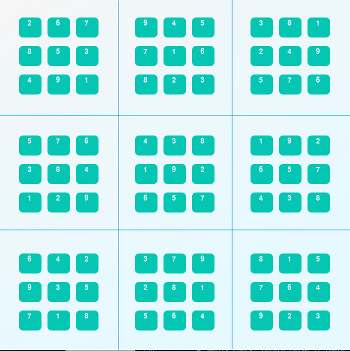

# Artificial Intelligence Nanodegree
## Introductory Project: Diagonal Sudoku Solver

# Question 1 (Naked Twins)
Q: How do we use constraint propagation to solve the naked twins problem?
A:
By finding a pair of matching twins in a board we can eliminate those values from neighboring cells.  The two boxes with the naked twins provide local solutions that satisfies the global contraint. This in turn alows us to continue to find solutions for other boxes while still staying within the global contraints. More specifically the naked twins remove possible solutions from other boxes which allows the algorithm to converge to a final solution in a more effecient manner.

# Question 2 (Diagonal Sudoku)
Q: How do we use constraint propagation to solve the diagonal sudoku problem?
A: By adding the diagonals to the peers being solved for we can eliminate possible values which are propagated to its neighbors. We are adding the diagonals into the set of contraints in order to solve the global problem. We can use contraint propagation to focus on finding a solution for the diagonals without having to worry about all the possible solutions as a whole.




### Install

This project requires **Python 3**.

We recommend students install [Anaconda](https://www.continuum.io/downloads), a pre-packaged Python distribution that contains all of the necessary libraries and software for this project.
Please try using the environment we provided in the Anaconda lesson of the Nanodegree.

##### Optional: Pygame

Optionally, you can also install pygame if you want to see your visualization. If you've followed our instructions for setting up our conda environment, you should be all set.

If not, please see how to download pygame [here](http://www.pygame.org/download.shtml).

### Code

* `solutions.py` - You'll fill this in as part of your solution.
* `solution_test.py` - Do not modify this. You can test your solution by running `python solution_test.py`.
* `PySudoku.py` - Do not modify this. This is code for visualizing your solution.
* `visualize.py` - Do not modify this. This is code for visualizing your solution.

### Visualizing

To visualize your solution, please only assign values to the values_dict using the ```assign_values``` function provided in solution.py

### Data

The data consists of a text file of diagonal sudokus for you to solve.
